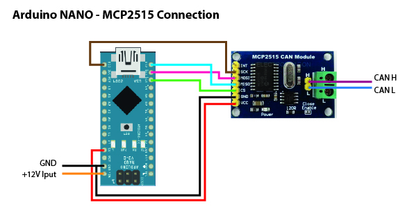

# CANBUS_Tribeca
## Hardware

Это модуль состоящий из Arduino и платы MCP2515 на 8MHz кварце с Ali.

Все подключается достаточно просто.

При этом можно подключать к пинам Arduino D0(Tx) и D1(Rx) другие модули для чтения данных по UART порту.

## Sowtvare

В текущей версии прошивки в Serail порт (на USB и на ноги D0(Tx) и D1(Rx)) отправляются все данные принимаемые из CAN шины без каких либо фильтраций.

